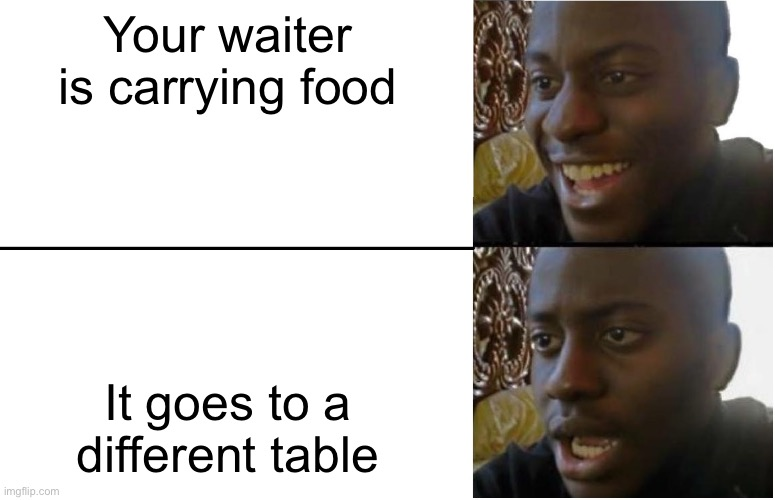

# oop-lab2

For this laboratory work I did choose a restaurant as my system. I did choose this system because I did work in a restaurant as a waiter and I know the main componenents of how a restaurant should look from a system point of view.

We have here 10 classes(check the folder classes): 1. Admin - an administrator takes care of a restaurant, check everything for being okay, track statistics and mainly is a problem resolver. In my systemusing only encapusaltion I did give him the role of keeping the waiters list.

    2. Employee - a class that for the moment keeps the record of our waiters(name, age, and the tables that are assigned to them).

    3. Bar, Menu, Sushi, Delivery - these classes keep our menus for different stations. In a normal restaurant that has a lot of variety in term of foods, they keep all their menu separated. It more accessible for the clients, easier to change in the case of modifying the structure or just a redesign.

    4. Kitchen, Reservation, Vip - these classes keep our important lists, like kitchen staff, reservations and vip(and directors). These classes contain more integral information for our system(restaurant). The class Vip gets special rules like they don't pay, they have special places in our restaurant.

    5. Stock - this class keeps track of our stock levels. It's a good practice to always keep the levels of stock in your restaurant between a range of 30-80.

Every class was implemented with the idea of encapsulation as the main purpose. The system and every entity can be reworked into doing a better job, keeping track of multiple thing and implementing new rules will be very much appreciated. But that was not the purpose of our laboratory work, so I kept the system on a basic level.

